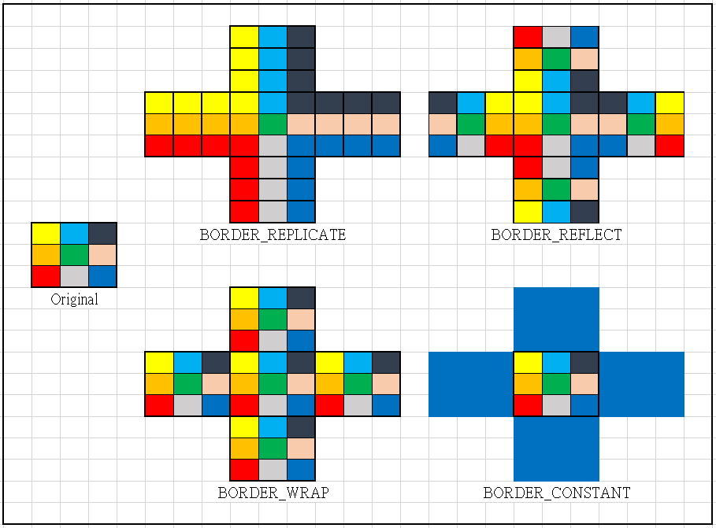

# Basic_Operation

## Descrption:
- know how to select a ROI (region of interest) in an image.
- know how to do "image padding" to fill the edge of an image.
- know how to use "image blending" and "birwise operation" to combine two images.

### Outline:
1. Image ROI
2. Image padding
3. Image blending
4. Bitwise operation

### 1. Image ROI 
```
- Input image: opencv.png
- Command Line: python image_ROI.py --image opencv.png
```


#### - Method 1: Use pixel range to select the region
```python
ROI_image = Input_Image[22:265, 60:311]
```
```
NOTE: 
  - notice that the image pixel x, y position in OpenCV is Input_Image[y, x].
  - ROI region x axis: from pixel 60 to 311, y axis: from pixel 22 to 265.
```
#### - Method 2: Use cv2.selectROI("input_image") to select the region
```python
r = cv2.selectROI(Input_Image)
ROI_img = image[int(r[1]):int(r[1]+r[3]), int(r[0]):int(r[0]+r[2])]
```
```
NOTE: r = (x, y, width, height), we can use these return region values to crop the image.
```

### 2. Image padding
```
- Input image: padding_source.png
- Command Line: python image_ROI.py --padding_source.png
```


#### - Method: Use cv2.copyMakeBorder(Source, top, bottom, left, right, borderType)
```
void cv::copyMakeBorder	( InputArray src,
                          OutputArray dst,
                          int 	top,
                          int 	bottom,
                          int 	left,
                          int 	right,
                          int 	borderType,
                          const Scalar & value = Scalar() 
)	
```
```python
* replicate = cv2.copyMakeBorder(..,cv2.BORDER_REPLICATE)
* reflect = cv2.copyMakeBorder(..,cv2.BORDER_REFLECT)
* wrap = cv2.copyMakeBorder(..,,cv2.BORDER_WRAP)
* constant= cv2.copyMakeBorder(..,cv2.BORDER_CONSTANT,value=BLUE)
```

### 2. Image blending
```
- Input image: 
  * Background image: dog.jpg
  * foreground image: moon.jpg
- Command Line: python image_blending.py --image dog.jpg --ontop moon.jpg
```


#### - Method: Use cv2.addWeighted(src_1,alpha,src_2,beta,gamma)
```
This function calculates the weighted sum of two images.
dst(I) = Saturate(src(I)*alpha + src(I)*beta + gamma)
```

### 2. Bitwise operation
```
- Input image: 
  * Background image: dog.jpg
  * foreground image: opencv.png
- Command Line: bitwiseOp.py --image dog.jpg --ontop opencv.png
```
#### - Function 1: Overlap two images


#### - Function 2: Add foreground image on the top left (or any desire position)

