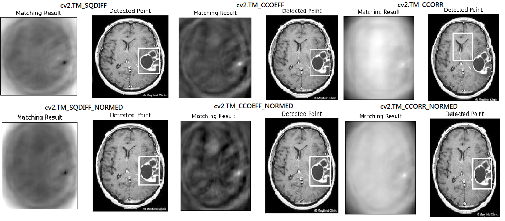
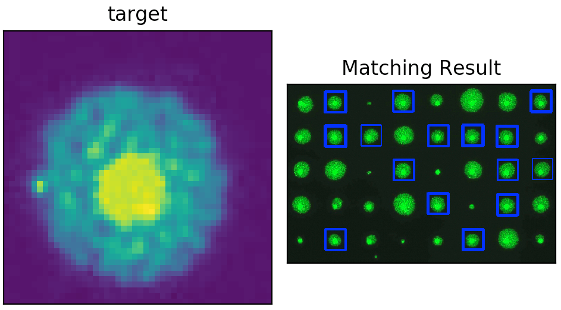

# Image Matching (Template Matching)
Template Matching is a method in image processing for searching the location of a template or a target image.

## Outline
- Template Matching
- Template Matching for Multi-Objects

## Template Matching
```
- File name: Image_Matching.py 
- Input image: brain.jpg 
- Input target: target.jpg
- Command Line: python Image_Matching.py -i brain.jpg -t target.jpg
```
* Main Function: res = cv2.matchTemplate(src_img, target, method)
```python
Method:
   * cv2.TM_CCOEFF            * cv2.TM_CCORR_NORMED
   * cv2.TM_CCOEFF_NORMED     * cv2.TM_SQDIFF
   * cv2.TM_CCORR             * cv2.TM_SQDIFF_NORMED
```
* The mathematic description for methods describe in [OpenCV-Python Documentation](https://docs.opencv.org/2.4/modules/imgproc/doc/object_detection.html)

```python
NOTE: use function cv2.minMaxLoc() to calculate the "rectangle" of the target.
  - min_val, max_val, min_loc, max_loc = cv2.minMaxLoc(res)
    * If method use "cv2.TM_SQDIFF", "cv2.TM_SQDIFF_NORMED", top_left = min_loc.
      Else, top_left = max_loc
    
  - cv2.rectangle(src_img, top_left, bottom_right, color, thickness)
    * top_left = min_loc or max_loc (depend on the method)
    * bottom_right = (top_left[0] + width, top_left[1] + height)
```



## Template Matching for Multi-objects
```
- File name: Image_Matching.py 
- Input image: cell.jpg
- Input target: cell_target.jpg
- Command Line: python Image_Matching.py -i cell.jpg -t cell_target.jpg
```
```
Set a threshold for the return value by using numpy.where() for cv2.matchTemplate(), then 
draw all the region using cv2.rectangle():

* location = np.where( res >= threshold )
```



### Useful link:

- [Changing Colorspace](https://github.com/Hank-Tsou/Computer-Vision-OpenCV-Python/tree/master/tutorials/Image_Processing/1_Changing_colorspace)

- [Image Thresholding](https://github.com/Hank-Tsou/Computer-Vision-OpenCV-Python/tree/master/tutorials/Image_Processing/2_Image_Thresholding)

## Code
- [Image Matching (Template Matching)](https://github.com/Hank-Tsou/Computer-Vision-OpenCV-Python/tree/master/tutorials/Image_Processing/10_Image_Matching)
- [Image Matching Implementation by Using Normalized Cross Correlation]

## License

This project is licensed under the MIT License - see the [LICENSE.md](LICENSE.md) file for details

## Acknowledgments

* OpenCV-Python Tutorial: https://opencv-python-tutroals.readthedocs.io/en/latest/py_tutorials/py_tutorials.html
* (minMaxLoc) https://docs.opencv.org/2.4/modules/core/doc/operations_on_arrays.html#void%20minMaxLoc(InputArray%20src,%20double*%20minVal,%20double*%20maxVal,%20Point*%20minLoc,%20Point*%20maxLoc,%20InputArray%20mask)
* (matchTemplate) https://docs.opencv.org/2.4/modules/imgproc/doc/object_detection.html
* (Drawing function) https://docs.opencv.org/2.4/modules/core/doc/drawing_functions.html
