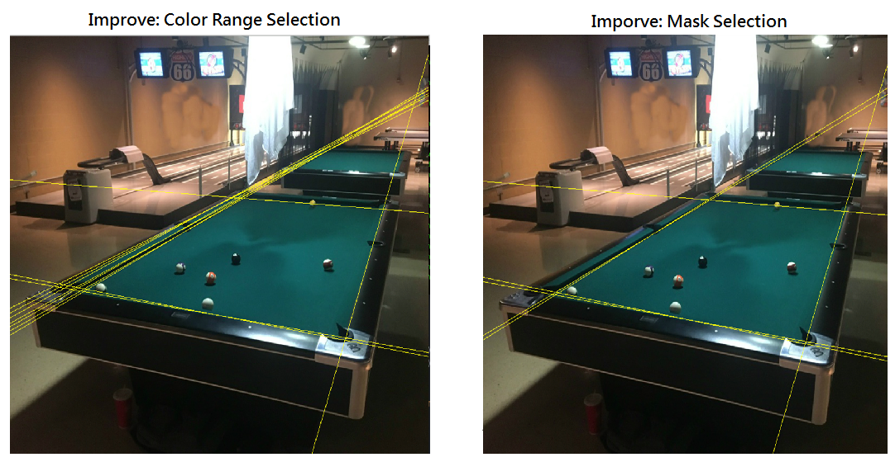

# Hough Line Transform - Improve table detection
This project apply pre-process on the original image to improve the result after hough line transform

## Outline
- Improvement: Select object by using color range.
- Improvement: Select object by generate mask for the target.

## Improvement: Select object by using color range
```
File name: table_color.py
Command line: python table_color.py
```
### Step of the process
  * (1) Using Color Range to Select The Target

  * (2) Edge Detection

  * (3) Hough Line Transform

## Improvement: Select object by generate mask for the target
```
File name: table_mask.py
Command line: python table_mask.py
```
### Step of the process
  * (1) Using Color Range to Select The Target

  * (2) Generate target mask (reduce noise line)

  * (3) Edge Detection

  * (4) Hough Line Transform



### Useful link:

- [Changing Colorspace](https://github.com/Hank-Tsou/Computer-Vision-OpenCV-Python/tree/master/tutorials/Image_Processing/1_Changing_colorspace)
- [Canny Edge Detection](https://github.com/Hank-Tsou/Computer-Vision-OpenCV-Python/tree/master/tutorials/Image_Processing/6_Canny_Edge_Detection)
- [Bitwise Operation](https://github.com/Hank-Tsou/Computer-Vision-OpenCV-Python/tree/master/tutorials/Core_Operation)
- [Image Contours](https://github.com/Hank-Tsou/Computer-Vision-OpenCV-Python/tree/master/tutorials/Image_Processing/8_Image_Contours)
- [Hough Line Transform](https://github.com/Hank-Tsou/Computer-Vision-OpenCV-Python/tree/master/tutorials/Image_Processing/11_Hough_Line_Transform)
- [Image Filtering](https://github.com/Hank-Tsou/Computer-Vision-OpenCV-Python/tree/master/tutorials/Image_Processing/4_Image_Filtering)

## Code
- [Hough Line Transform](https://github.com/Hank-Tsou/Computer-Vision-OpenCV-Python/tree/master/tutorials/Image_Processing/11_Hough_Line_Transform)
- [Implement Hough Line Transform from Scratch](https://github.com/Hank-Tsou/Hough-Transform-Line-Detection)
- [Hough Line Transform - Improve table detection](https://github.com/Hank-Tsou/Computer-Vision-OpenCV-Python/tree/master/tutorials/Image_Processing/11_Hough_Line_Transform/Improve_table_detection)

## License

This project is licensed under the MIT License - see the [LICENSE.md](LICENSE.md) file for details

## Reference & Acknowledgments

* OpenCV-Python Tutorial: https://opencv-python-tutroals.readthedocs.io/en/latest/py_tutorials/py_tutorials.html

