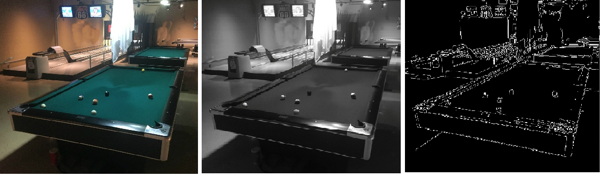

# Hough Line Transform
"Hough Transform" is a method to detect any shape with a mathematical shape equation, here describe how hough transform work with line detection.

* Provide Hough Line Transform implement from scatch. [(Code)]

## Outline
- Hough Line Transform
- Probabilistic Hough Line Transform

## Steps of Process
* (1) Find edges in the source image
* (2) Generate a matrix by 'theta' and 'rho'
* (3) Convert (x, y) Coordinate System to (theta, rho) Coordinate System
* (4) Use threshold to select the Line

### Step 1. Get an edge image from original input image

* Read image and convert to grayscale using cv2.cvtColor().
* Get edge image by using Canny Edge Detection, cv2.Canny().



### Step 2. Generate a matrix by "theta" and "rho"

* General line equation: y = ax+b
* Hough Line Transform use another line representation: x * cos(theta)+y * sin(theta) = rho


### Step 3. Calculate (theta, rho) for each edge pixel (x, y) then add 1 to the matrix (theta, rho)


### Step 4. Get the several high value in matrix then use that 'theta' and 'rho' value to draw the line.

```python
a = np.cos(theta)   x0 = a * rho
b = np.sin(theta)   y0 = b * rho

x1 = int(x0 + 1000*(-b))
y1 = int(y0 + 1000*(a))
x2 = int(x0 - 1000*(-b))
y2 = int(y0 - 1000*(a))

Draw Line: cv2.line(src_img, (x1,y1), (x2,y2), Color, thickness)
```

### Useful link:

- [Changing Colorspace](https://github.com/Hank-Tsou/Computer-Vision-OpenCV-Python/tree/master/tutorials/Image_Processing/1_Changing_colorspace)
- [Canny Edge Detection](https://github.com/Hank-Tsou/Computer-Vision-OpenCV-Python/tree/master/tutorials/Image_Processing/6_Canny_Edge_Detection)
- [Youtube: How Hough Transform works](https://www.youtube.com/watch?v=4zHbI-fFIlI)

## Hough Line Transform
```
- File name: Hough_Line_Transform.py
- Input image: pool.jpg
- Command Line: python Hough_Line_Transform.py -i pool.jpg
```

* Main Function: lines = cv2.HoughLines(src_img, rho, theta, threshold)
```python
* rho: Distance resolution of the accumulator in pixels.
* theta: Angle resolution of the accumulator in radians. (np.pi/180)
* threshold: Accumulator threshold, line selection.
```

## Probabilistic Hough Line Transform
Probabilistic Hough Transform is an optimization of Hough Transform we saw. It doesn’t take all the points into consideration, instead take only a random subset of points and that is sufficient for line detection.  --(OpenCV-Python documentation)

* Main Function: lines = cv2.HoughLinesP(image, rho, theta, threshold, minLineLength, maxLineGap)
```python
* minLineLength: Minimum line length. Line segments shorter than that are rejected.
* maxLineGap: Maximum allowed gap between points on the same line to link them.
```
```
NOTE: This method returns the two endpoints of lines. HoughLines() only return the parameters of lines.
```


## Code
- [Hough Line Transform](https://github.com/Hank-Tsou/Computer-Vision-OpenCV-Python/tree/master/tutorials/Image_Processing/11_Hough_Line_Transform)

## Improvements

## License

This project is licensed under the MIT License - see the [LICENSE.md](LICENSE.md) file for details

## Reference & Acknowledgments

* OpenCV-Python Tutorial: https://opencv-python-tutroals.readthedocs.io/en/latest/py_tutorials/py_tutorials.html
* (Hough Line) https://docs.opencv.org/2.4/modules/imgproc/doc/feature_detection.html?highlight=houghlines
* (Draw Line) https://docs.opencv.org/2.4/modules/core/doc/drawing_functions.html
