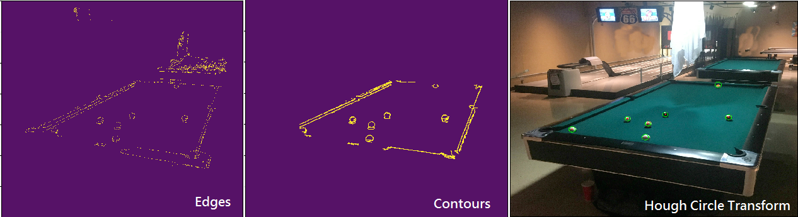

## Hough Circle Transform - Improve ball detection
```
NOTE: The description is same as previous page "12_Hough_Circle_Transform"
```
```
Folder name: Improve_ball_detection
File name: hough_circle.py
Command: python hough_circle.py
```
### Step of the process
* (1) Use color information to select pool table
* (2) Canny Edge Detection
* (3) Apply mask for the pool table then find contour for the ball
* (4) Hough Circle Transform

```
The process and result of the improvement show as below:
```


## Code
- [Hough Circle Transform](https://github.com/Hank-Tsou/Computer-Vision-OpenCV-Python/tree/master/tutorials/Image_Processing/12_Hough_Circle_Transform)
- [Hough Circle Transform - Improve ball detection](https://github.com/Hank-Tsou/Computer-Vision-OpenCV-Python/tree/master/tutorials/Image_Processing/12_Hough_Circle_Transform/Improve_ball_detection)


## License

This project is licensed under the MIT License - see the [LICENSE.md](LICENSE.md) file for details

## Reference & Acknowledgments

* OpenCV-Python Tutorial: https://opencv-python-tutroals.readthedocs.io/en/latest/py_tutorials/py_tutorials.html
* (Hough Circle) https://docs.opencv.org/2.4/modules/imgproc/doc/feature_detection.html?highlight=houghcircles
