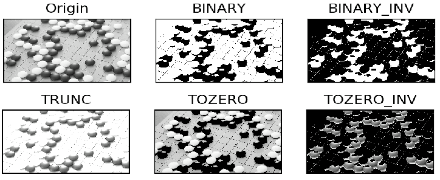

# Image Thresholding
```
If pixel value is greater than a threshold value, it is assigned one value, else it is assigned 
another value 
```
## Outline:
- Simple thresholding 
- Adaptive thresholding
- Otsu’s thresholding

([Full code in python](https://github.com/Hank-Tsou/Computer-Vision-OpenCV-Python/blob/master/tutorials/Image_Processing/2_Image_Thresholding/Image_Threshold.py))

### 1. Simple thresholding 
```
- Input image: thresh.jpg
- Command Line: python Image_threshold.py -i thresh.jpg
```
```python
Function: ret,thresh = cv2.threshold(src_img, threshValue, maxValue, thresholdType)
  - type:
    * cv.THRESH_BINARY
    * cv.THRESH_BINARY_INV
    * cv.THRESH_TRUNC
    * cv.THRESH_TOZERO
    * cv.THRESH_TOZERO_INV)
```

```python
Threshold type and math description:

- cv2.THRESH_BINARY             - cv2.THRESH_BINARY_INV              - cv2.THRESH_TRUNC
  # if src(x,y) > thresh          # if src(x,y) > thresh               # if src(x,y) > thresh
  #   dst(x,y) = maxValue         #   dst(x,y) = 0                     #   dst(x,y) = thresh
  # else                          # else                               # else
  #   dst(x,y) = 0                #   dst(x,y) = maxValue              #   dst(x,y) = src(x,y)
  
- cv2.THRESH_TOZERO             - cv2.THRESH_TOZERO_INV
  # if src(x,y) > thresh          # if src(x,y) > thresh
  #   dst(x,y) = src(x,y)         #   dst(x,y) = 0
  # else                          # else
  #   dst(x,y) = 0                #   dst(x,y) = src(x,y)
```


#### 2. Adaptive thresholding
```
- Input image: thresh.jpg
- Command Line: python Image_threshold.py -i thresh.jpg
```
```python
Function: th = cv2.adaptiveThreshold(src_img, maxValue, adaptiveMethod, thresholdType, blockSize, C)
```
```python
Adaptive method and math description:

- cv2.ADAPTIVE_THRESH_MEAN_C:
  The threshold value T(x,y) is a mean of the blockSize x blockSize neighborhood of (x, y) minus C.

- cv2.ADAPTIVE_THRESH_GAUSSIAN_C:
  The threshold value T(x, y) is a weighted sum (cross-correlation with a Gaussian window) of the 
  blockSize x blockSize neighborhood of (x, y) minus C
```


#### 3. Otsu’s Binarization thresholding
```
- Input image: noise.jpg
- Command Line: python Image_threshold.py -i noise.jpg
```
```python
Function: ret,th = cv2.threshold(src_img, threshValue, maxValue, thresholdType)
ThresholdType: cv2.THRESH_BINARY+cv2.THRESH_OTSU
```
```python
Otsu’s Binarization thresholding and math description:

- This method is better to use with "bimodal image" which is an image whose histogram has two peaks.
- cv2.THRESH_OTSU
  This method automatically calculates a threshold value from image histogram for a bimodal image. 
  (For images which are not bimodal, binarization won’t be accurate.)
```


```
NOTE: Can apply Gaussian filter on the image to improve the result
      - Function: cv2.GaussianBlur(src_img,(kernel size),sigma)
```
[(see "Smoothing Images" for more detail on Gaussian Filtering)](https://github.com/Hank-Tsou/Computer-Vision-OpenCV-Python/edit/master/tutorials/Image_Processing/2_Image_Thresholding/README.md)] (Unavailable)

[How Otsu's Binarization Works?](https://docs.opencv.org/3.4.0/d7/d4d/tutorial_py_thresholding.html)

[Youtube](https://www.youtube.com/watch?v=mnmjZOLjoBA)

## Code
- [Image Thresholding](https://github.com/Hank-Tsou/Computer-Vision-OpenCV-Python/blob/master/tutorials/Image_Processing/2_Image_Thresholding/Image_Threshold.py)

## License

This project is licensed under the MIT License - see the [LICENSE.md](LICENSE.md) file for details

## Acknowledgments

* OpenCV-Python Tutorial: https://opencv-python-tutroals.readthedocs.io/en/latest/py_tutorials/py_tutorials.html
* (threshold) Link: https://docs.opencv.org/3.4.0/d7/d4d/tutorial_py_thresholding.html
