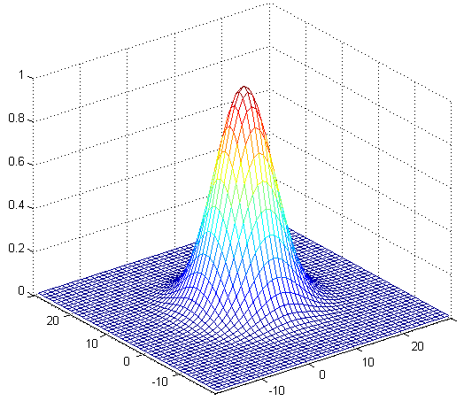
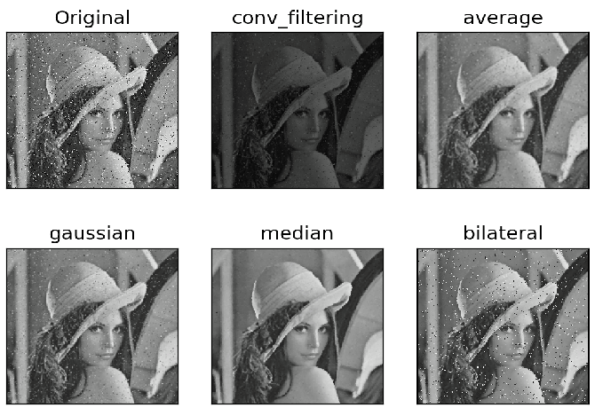

# Image Filtering
Images can be filtered with various filters. "Low Pass Filter" helps in removing noise, or blurring the image. 
"High Pass Filter" helps in finding edges in an image.

## Outline:
- Image filtering (Image Blurring, Image Smoothing) ([Full code in python](https://github.com/Hank-Tsou/Computer-Vision-OpenCV-Python/blob/master/tutorials/Image_Processing/4_Image_Filtering/Image_filtering.py))
    - 2D convolution Filtering
    - Averaging Filtering
    - Gaussian Filtering
    - Median Filtering
    - Bilateral Filtering

### 1. Image Filtering 
```
- Input image: noise.png
- Command Line: python Image_filtering.py -i noise.png
```

#### a. 2D convolution Filtering
```
Function: conv_filtering = cv2.filter2D(src_img, ddepth, kernel)
    - ddepth: Desired depth of the destination image, here we set negative to be the same as source.
```
```python
NOTE: 
  - Use numpy to generate kernel (Filter)
    kernel = np.ones(kernel_size, np.float32)
```
```
Below is how convolution filter work on an image:
```


#### b. Averaging Filtering
```
Function: average = cv2.blur(src_img, kernel_size)
```
```
The function using kernel:

K = 1/(kernel_width * kernel_height) * np.ones(kernel_size, np.float32) [opecv-python documentation]
```
#### c. Gaussian Filtering
```
Function: gaussian = cv2.GaussianBlur(src_img, kernel size, sigmaX)
    - sigmaX: Gaussian kernel standard deviation in X direction. Here set to 0.
    - sigmaY: Gaussian kernel standard deviation in Y direction. Set to 0 by default.
```


#### d. Median Filtering
```
Function: median = cv2.medianBlur(src_img, ksize)
    - ksize: aperture linear size; it must be odd and greater than 1.
```
```
This function smoothes an image using the median filter with the ksize * ksize aperture.
```
#### e. Bilateral Filtering
```
Function: bilateral = cv2.bilateralFilter(src_img, d, sigmaColor, sigmaSpace)
    - d: Diameter of each pixel neighborhood that is used during filtering. 
    - sigmaColor: Filter sigma in the color space. 
    - sigmaSpace: Filter sigma in the coordinate space. 
```
[- See opencv-python documentation](https://docs.opencv.org/2.4/modules/imgproc/doc/filtering.html)

[- Paper: Bilateral Filtering for Gray and Color Images](http://homepages.inf.ed.ac.uk/rbf/CVonline/LOCAL_COPIES/MANDUCHI1/Bilateral_Filtering.html)



## Code
- [Image Filtering](https://github.com/Hank-Tsou/Computer-Vision-OpenCV-Python/blob/master/tutorials/Image_Processing/4_Image_Filtering/Image_filtering.py)

## License

This project is licensed under the MIT License - see the [LICENSE.md](LICENSE.md) file for details

## Acknowledgments

* OpenCV-Python Tutorial: https://opencv-python-tutroals.readthedocs.io/en/latest/py_tutorials/py_tutorials.html
* (Conv_filter GIF) Link: https://icecreamlabs.com/2018/08/19/3x3-convolution-filters%E2%80%8A-%E2%80%8Aa-popular-choice/
* (Filtering) https://docs.opencv.org/2.4/modules/imgproc/doc/filtering.html
