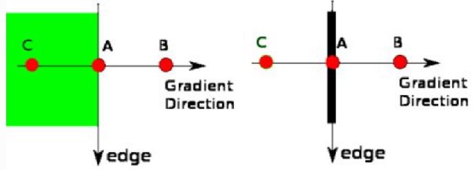
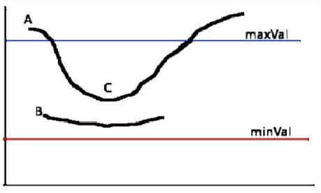
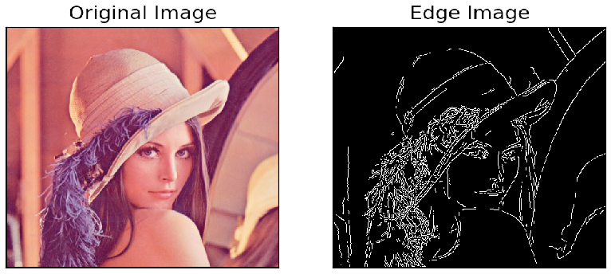

# Canny Edge Detection
Link to "Canny Edge Detection" implementation from scratch. [(Edge detection)](https://github.com/Hank-Tsou/Implement-Edge-Detection)

## Step of the process
- (1) Noise Reduction
- (2) Find Intensity Gradient and Orientation of the Image
- (3) Non-maximum Suppression
- (4) Hysteresis Thresholding

### Step 1. Noise Reduction
Noise will effect the accuracy of the result, so the first step of canny edge detection is to reduce noise by using 5x5 Gaussian filter. [(see Image Filtering)](https://github.com/Hank-Tsou/Computer-Vision-OpenCV-Python/tree/master/tutorials/Image_Processing/4_Image_Filtering)

### Step 2. Find Intensity Gradient (magnitude) and Orientation of the Image
(a) Use [Sobel kernel](https://github.com/Hank-Tsou/Computer-Vision-OpenCV-Python/tree/master/tutorials/Image_Processing/5_Image_Gradient) in both horizontal and vertical direction to get first derivative of both direction Gx, Gy. 

(b) Then we can find [edge gradient](https://github.com/Hank-Tsou/Computer-Vision-OpenCV-Python/tree/master/tutorials/Image_Processing/5_Image_Gradient) and direction for each pixel with the above two result images.

The equation is as follow (assume image matrix = 'I'):
```
* First derivative: Gx = I * sobel_x, Gy = I * sobel_y

* Edge gradient: G = sqrt(Gx^2 + Gy^2)
* Edge direction: A = arctan(Gy/Gx)
```
```
NOTE: In implementation, we need to transform orientation value to degree (orientation*180/pi), 
then clasify each pixel into 0, 45, 90 and 135 degree
```

### Step 3. Non-maximum Suppression
This step is going to remove unwanted pixel by checking if it is a local maximum in its neighborhood in the direction of gradient.

```
Below explanation is from "openCV-python documentation:"
```


Point A is on the edge ( in vertical direction). Gradient direction is normal to the edge. Point B and C are in gradient directions. So point A is checked with point B and C to see if it forms a local maximum. If so, it is considered for next stage, otherwise, it is suppressed ( put to zero).

### Step 4. Hysteresis Thresholding
This step need to find two threshold values, minVal and maxVal to determine the edges.

```
Below explanation is from "openCV-python documentation:"
```


The edge A is above the maxVal, so considered as “sure-edge”. Although edge C is below maxVal, it is connected to edge A, so that also considered as valid edge and we get that full curve. But edge B, although it is above minVal and is in same region as that of edge C, it is not connected to any “sure-edge”, so that is discarded. So it is very important that we have to select minVal and maxVal accordingly to get the correct result.

```
NOTE: In implementation, we need to implement a function for finding a connected pixels.
```

### Canny Edge Detection

```
- Input image: Lenna.jpg
- Command Line: python Canny_Edge_Detection.py -i Lenna.jpg
```



## Code
- [Canny Edge Detection](https://github.com/Hank-Tsou/Computer-Vision-OpenCV-Python/tree/master/tutorials/Image_Processing/6_Canny_Edge_Detection)
- [Implementation from scratch](https://github.com/Hank-Tsou/Implement-Edge-Detection)

## License

This project is licensed under the MIT License - see the [LICENSE.md](LICENSE.md) file for details

## Acknowledgments

* OpenCV-Python Tutorial: https://opencv-python-tutroals.readthedocs.io/en/latest/py_tutorials/py_tutorials.html

