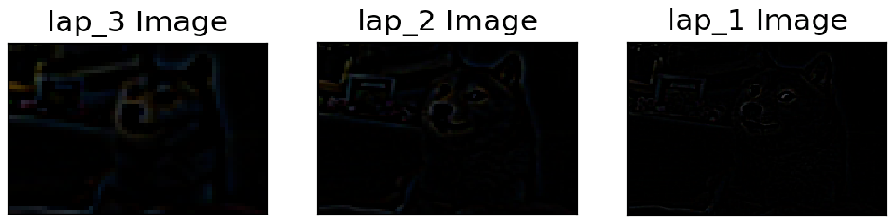

# Image Pyramids

## Outline
- Image pyramid
    - Gaussian pyramid
    - Laplacian pyramid

### Image Pyramids
```
- Input image: dog.jpg
- Command Line: python Image_Pyramid.py -i dog.jpg
```
#### 1. Gaussian pyramids
```
Each pixel is constructed by calculating a gaussian weighted average of the neighboring pixels of a 
source image and scaling the image down. 

During down sampling process a M * N image becomes M/2 * N/2 image. So area reduces to 1/4 of 
original area. The similar process as doing up sampling.
```
```python
down_sampling = cv2.pyrDown(src_img, dst_size)
up_sampling = cv2.pyrUp(src_img, dst_size)
    - dst_size: result image size
```


#### 2. Laplacian pyramids




## Code
- [Image pyramids](https://github.com/Hank-Tsou/Computer-Vision-OpenCV-Python/tree/master/tutorials/Image_Processing/7_Image_Pyramids)
- [Implement pyramid image blending](https://github.com/Hank-Tsou/Image-Pyramids)

## License

This project is licensed under the MIT License - see the [LICENSE.md](LICENSE.md) file for details

## Acknowledgments

* OpenCV-Python Tutorial: https://opencv-python-tutroals.readthedocs.io/en/latest/py_tutorials/py_tutorials.html

