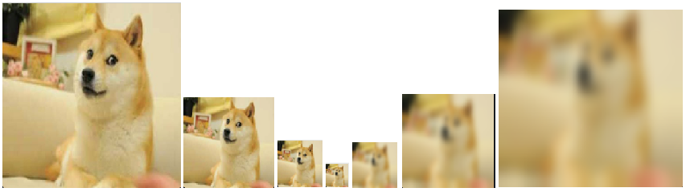
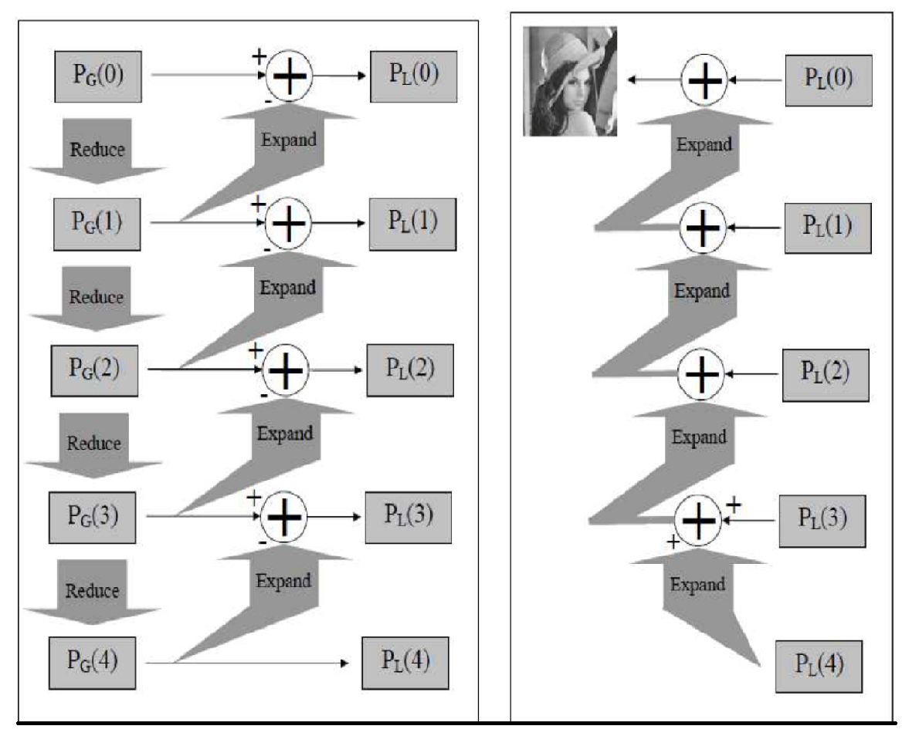

# Image Pyramids

## Outline
- Image pyramid
    - Gaussian pyramid
    - Laplacian pyramid

### Image Pyramids
```
- Input image: dog.jpg
- Command Line: python Image_Pyramid.py -i dog.jpg
```
#### 1. Gaussian pyramids
Each pixel is constructed by calculating a gaussian weighted average of the neighboring pixels of a source image and scaling the image down. 

During down sampling process a M * N image becomes M/2 * N/2 image. So area reduces to 1/4 of original area. The opposite process as doing up sampling.

```python
down_sampling = cv2.pyrDown(src_img, dst_size)
up_sampling   = cv2.pyrUp(src_img, dst_size)
    - dst_size: result image size
```

```
NOTE: In figure above, while doing up sampling, image decrease resolution because the process 
lost information during down sampling.
```

#### 2. Laplacian pyramids
Laplacian Pyramids are formed from the Gaussian Pyramids. A level in Laplacian Pyramid is formed by the difference between that level in Gaussian Pyramid and expanded version of its upper level in Gaussian Pyramid. The process show as below:

```
  * Generate Laplacian Pyramids:               * Re-construct the image using Laplasian pyramid:

    L0 = G0 - G1(Expand)                         re-construct(3) = L3 + L4(Expand)
    L1 = G1 - G2(Expand)                         re-construct(2) = L2 + re-construct(3)(Expand)
    L2 = G2 - G3(Expand)                         re-construct(1) = L1 + re-construct(2)(Expand)
        .                                        re-construct image = L0 + re-construct(1)(Expend)
        .
        .
```

```
NOTE: Can adjust the screen brighter to see the contour of the image below or it will be all black.
```


## Code
- [Image pyramids](https://github.com/Hank-Tsou/Computer-Vision-OpenCV-Python/tree/master/tutorials/Image_Processing/7_Image_Pyramids)
- [Implement pyramid image blending](https://github.com/Hank-Tsou/Image-Pyramids)

## License

This project is licensed under the MIT License - see the [LICENSE.md](LICENSE.md) file for details

## Acknowledgments

* OpenCV-Python Tutorial: https://opencv-python-tutroals.readthedocs.io/en/latest/py_tutorials/py_tutorials.html

