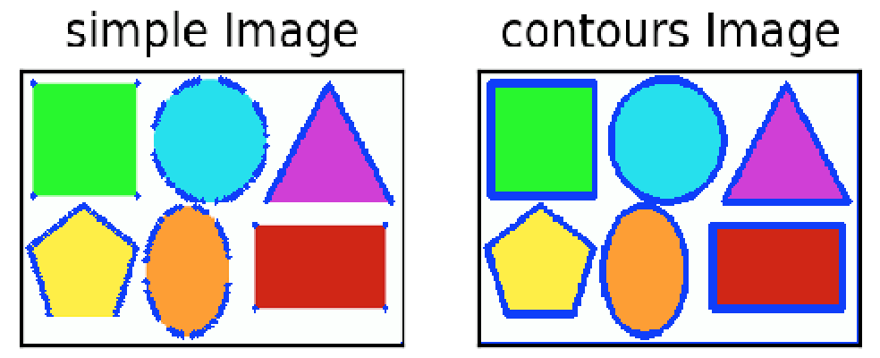
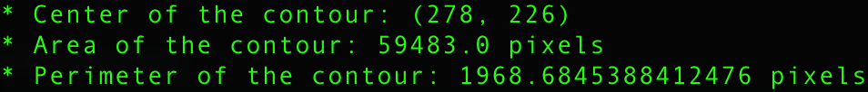
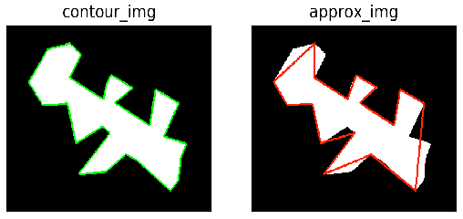
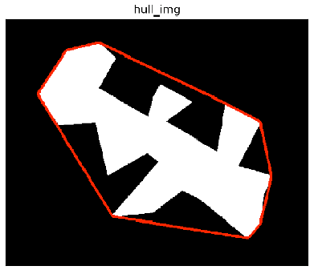
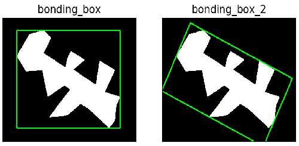
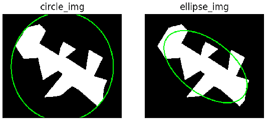
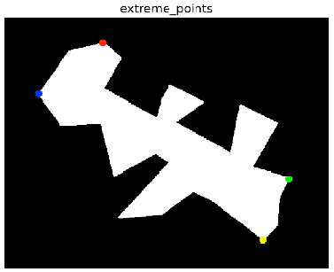

# Image Contours

## Outline
- Image Contours
- Contour Features
  - Moments
  - Contour Area and Perimeter
  - Contour Approximation
  - Convex Hull
  - Bounding Rectangle
  - Minimum Enclosing Circle and Fitting an Ellipse
  - Extreme Points

## Image Contours [(Code)](https://github.com/Hank-Tsou/Computer-Vision-OpenCV-Python/blob/master/tutorials/Image_Processing/8_Image_Contours/Image_Contours.py)
In OpenCV, finding contours is like finding white object from black background. So object to be found should be white and background should be black.   - (from openCV-python tutorial)
```
- File name: Image_Contours.py
- Input image: shapes.png
- Command Line: python Image_Contours.py -i shapes.png
```
```
Main Function: 
  - Find Contours: image, contours, hierarchy = cv2.findContours(src_img, mode, method)
    * return contour structure(list): [ [contour_1] [contour_2] [contour_3] ... ]
    
  - Draw Contours: contour_img = cv2.drawContours(src_img, contour, contour_index, color, thickness)
    * contour_index = -1, draw all the contours.
```
```python
cv2.findContours() mode and method:

- mode:
  * CV_RETR_EXTERNAL: retrieves only the extreme outer contours.
  * CV_RETR_LIST: retrieves all of the contours without establishing any hierarchical relationships.
  * CV_RETR_CCOMP: retrieves all of the contours and organizes them into a two-level hierarchy. 
  * CV_RETR_TREE: retrieves all of the contours and reconstructs a full hierarchy of nested contours.   

- method:
  * CV_CHAIN_APPROX_NONE: stores absolutely all the contour points. 
  * CV_CHAIN_APPROX_SIMPLE: stores only several important points.
```
```
NOTE: 
  * FindContours() modifies the source image. So can use image.copy() to store the original image.
  * The different between two Contour approximation method show as blow:
    (1) cv2.CV_CHAIN_APPROX_SIMPLE
    (2) cv2.CV_CHAIN_APPROX_NONE
```


### More - drawpoint function
```
cv2.findContours() will return contour pixels, and cv2.drawContours() will automatically connect all 
the pixels. In order to see the real return contour points, here use cv2.circle() to draw a dot on 
each contour pixel.

* Function: cv2.circle(src_img, center, radius, color, thickness)
```

## Image Features [(Code)](https://github.com/Hank-Tsou/Computer-Vision-OpenCV-Python/blob/master/tutorials/Image_Processing/8_Image_Contours/Contour_Feature.py)
```python
- File name: Contour_Feature.py
- Input image: feature.png
- Command Line: python Contour_Feature.py -i feature.png
```

#### a. Moments
Image moments help you to calculate some features like center of mass of the object, area of the object etc. Check out the wikipedia page on [Image Moments](https://en.wikipedia.org/wiki/Image_moment)   - (from openCV-python tutorial)
```python
Main Function: M = cv2.moments(contour)
```
```
Here extract useful data from moments(M) to calculate contour Centroid:
  * cx = int(M['m10']/M['m00'])
  * cy = int(M['m01']/M['m00'])
```

#### b. Contour Area and Perimeter
```python
Main Function:
  (1) area = cv2.contourArea(contour)
  (2) perimeter = cv2.arcLength(contour, isClosed)
      - isClosed: whether the curve is closed or not.
```
```
NOTE: The unit for the Area and Perimeter is "pixel".
```


#### c. Contour Approximation
It approximates a contour shape to another shape with less number of vertices depending upon the precision(epsilon) we specify.

```python
Main Function: approx = cv2.approxPolyDP(contour, epsilon, isClosed)

epsilon = 0.02 * cv2.arcLength(contour,isClosed)
  - epsilon: Parameter specifying the approximation accuracy. This is the maximum distance between 
             the original curve and its approximation.
```


#### d. Convex Hull [(Implementation using Graham's Scan)](https://github.com/Hank-Tsou/Convex-Hull)
 ```
 Main Function: hull = cv2.convexHull(contour)
 ```
 
 
 ```
 NOTE: Provide implementation using Graham Scan Algorithm to find convex hull, see code link.
 ```
 
#### e. Bounding Rectangle

```python
Main Function for "straight rectangle":
  (1) x,y,w,h = cv2.boundingRect(contour)
      * (x,y) is the top-left of the rectangle and (w,h) is its width and height.
      
  (2) bonding_box = cv2.rectangle(src_img, point_1, point_2, color, thickness)
      * point_1: Vertex of the rectangle.
      * point_2: Vertex of the rectangle opposite to point_1 .
```
```python
Main Function for "rotated rectangle":
  - rectangle = cv2.minAreaRect(contour)
    * box = cv2.boxPoints(rectangle)
```
```
NOTE: use numpy to get the rotated box contours --> box = np.int0(box)
```

 
#### f. Minimum Enclosing Circle
 ```python
Main Function for "Enclosing Circle":
  - (x,y),radius = cv2.minEnclosingCircle(contour)
    * circle_img = cv2.circle(src_img, center, radius,color, thickness)
```
```python
Main Function for "Fitting an Ellipse":
  - ellipse = cv2.fitEllipse(contour)
   * ellipse_img = cv2.ellipse(src_img, ellipse, color, thickness)
```

 
#### g. Extreme Points
```python
Main Function:
  - leftmost = tuple(cnt[cnt[:,:,0].argmin()][0])
  - rightmost = tuple(cnt[cnt[:,:,0].argmax()][0])
  - topmost = tuple(cnt[cnt[:,:,1].argmin()][0])
  - bottommost = tuple(cnt[cnt[:,:,1].argmax()][0])
```
```
NOTE: use cv2.circle() to draw a dot on 4 extreme points.
```


## More Contour Properties and Functions
- [Contour Properties](https://opencv-python-tutroals.readthedocs.io/en/latest/py_tutorials/py_imgproc/py_contours/py_contour_properties/py_contour_properties.html)
- [More Functions](https://opencv-python-tutroals.readthedocs.io/en/latest/py_tutorials/py_imgproc/py_contours/py_contours_more_functions/py_contours_more_functions.html)
- [Contours Hierarchy](https://opencv-python-tutroals.readthedocs.io/en/latest/py_tutorials/py_imgproc/py_contours/py_contours_hierarchy/py_contours_hierarchy.html)

## Code
- [Image Contours](https://github.com/Hank-Tsou/Computer-Vision-OpenCV-Python/blob/master/tutorials/Image_Processing/8_Image_Contours/Image_Contours.py)
- [Contour Features](https://github.com/Hank-Tsou/Computer-Vision-OpenCV-Python/blob/master/tutorials/Image_Processing/8_Image_Contours/Contour_Feature.py)
- [Convex Hull Implementation](https://github.com/Hank-Tsou/Convex-Hull)

## License

This project is licensed under the MIT License - see the [LICENSE.md](LICENSE.md) file for details

## Reference & Acknowledgments

* OpenCV-Python Tutorial: https://opencv-python-tutroals.readthedocs.io/en/latest/py_tutorials/py_tutorials.html
* (Contours) https://docs.opencv.org/2.4/modules/imgproc/doc/structural_analysis_and_shape_descriptors.html?highlight=minarearect#double%20arcLength(InputArray%20curve,%20bool%20closed)
* (Drawing) https://docs.opencv.org/2.4/modules/core/doc/drawing_functions.html
