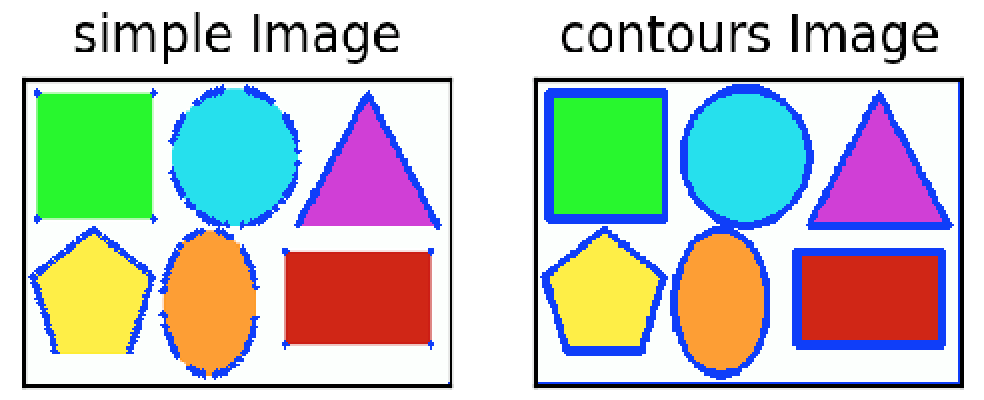

# Image Contours

## Outline
- Image Contours
- Contour Features

### Image Contours
In OpenCV, finding contours is like finding white object from black background. So object to be found should be white and background should be black.  - (from openCV-python tutorial)
```
- Input image: shapes.png
- Command Line: python Image_Contours.py -i shapes.png
```
Function: image, contours, hierarchy = cv2.findContours(src_img, mode, method)
```python
- mode:
  * CV_RETR_EXTERNAL: retrieves only the extreme outer contours.
  * CV_RETR_LIST: retrieves all of the contours without establishing any hierarchical relationships.
  * CV_RETR_CCOMP: retrieves all of the contours and organizes them into a two-level hierarchy. 
  * CV_RETR_TREE: retrieves all of the contours and reconstructs a full hierarchy of nested contours. 
- method:
  * CV_CHAIN_APPROX_NONE: stores absolutely all the contour points. 
  * CV_CHAIN_APPROX_SIMPLE: stores only several important points.
```
```
NOTE: FindContours() modifies the source image. So can use image.copy() to store the original image.
```



#### 1. Gaussian pyramids
Each pixel is constructed by calculating a gaussian weighted average of the neighboring pixels of a source image then remove every even-numbered row and column to scale the image down. 

During down sampling process a M * N image becomes M/2 * N/2 image. So area reduces to 1/4 of original area. The opposite process for doing up sampling.

```python
down_sampling = cv2.pyrDown(src_img, dst_size)
up_sampling   = cv2.pyrUp(src_img, dst_size)
    - dst_size: result image size
```

```
NOTE: In figure above, while doing up sampling, image decrease resolution because the process 
lost information during down sampling.
```

#### 2. Laplacian pyramids
Laplacian Pyramids are formed from the Gaussian Pyramids. A level in Laplacian Pyramid is formed by the difference between that level in Gaussian Pyramid and expanded version of its upper level in Gaussian Pyramid. The process show as below:

```
  * Generate Laplacian Pyramids:               * Re-construct the image using Laplasian pyramid:

    L0 = G0 - G1(Expand)                         re-construct(3) = L3 + L4(Expand)
    L1 = G1 - G2(Expand)                         re-construct(2) = L2 + re-construct(3)(Expand)
    L2 = G2 - G3(Expand)                         re-construct(1) = L1 + re-construct(2)(Expand)
        .                                        re-construct image = L0 + re-construct(1)(Expend)
        .
        .
```

```
NOTE: Laplacian pyramid images are like edge images. Can adjust the screen brighter to see the 
contour of the image below or it will be all black.
```


## Code
- [Image pyramids](https://github.com/Hank-Tsou/Computer-Vision-OpenCV-Python/tree/master/tutorials/Image_Processing/7_Image_Pyramids)
- [Implement pyramid image blending](https://github.com/Hank-Tsou/Image-Pyramids)

## License

This project is licensed under the MIT License - see the [LICENSE.md](LICENSE.md) file for details

## Acknowledgments

* OpenCV-Python Tutorial: https://opencv-python-tutroals.readthedocs.io/en/latest/py_tutorials/py_tutorials.html
* (Gaussian pyramid) https://docs.opencv.org/2.4/doc/tutorials/imgproc/pyramids/pyramids.html
* (Laplacian process) http://www.eng.tau.ac.il/~ipapps/Slides/lecture05.pdf
