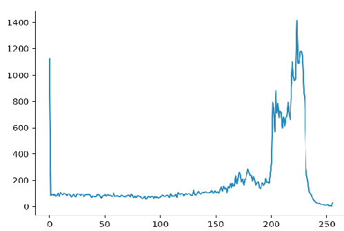
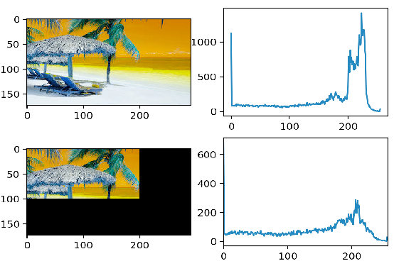
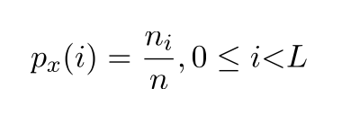
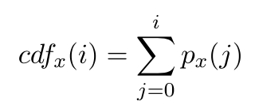
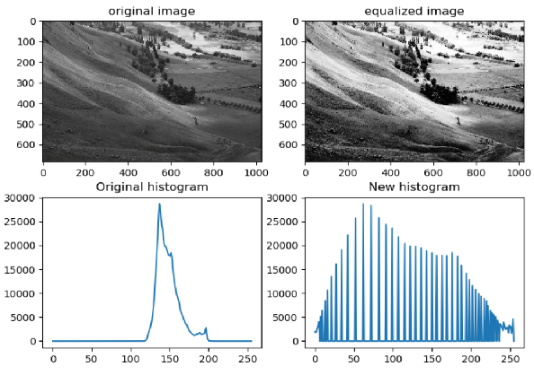

# Image Histogram

## Outline
- Image Histogram
- Histogram Equalization

## Image Histogram
Image histogram is a graph showing distribution of the pixel intensity values in an image.
```
- File name: Image_Histogram.py
- Input image: input_image.jpg
- Command Line: python Image_Histogram.py -i input_image.jpg
```

### (a) Image Histogram
```python
Main Function: hist = cv2.calcHist(src_img, channels, mask, hist_size, range)

  * mask: Input mask or None
  * hist_size: Array of histogram sizes in each dimension.
  * range: Boundaries in each dimension
```


```
NOTE: An single channel image has 256 different possible intensities (0-255).
```

### (b) Partial Image Histogram
  * Step 1: Generate a binary mask.
  * Step 2: Use mask to select the region for calculate the histogram.
```python
Main Function: hist = cv2.calcHist(src_img, channels, mask, hist_size, range)
  * mask: Input mask = mask
```


### Useful link:

[Changing Colorspace](https://github.com/Hank-Tsou/Computer-Vision-OpenCV-Python/tree/master/tutorials/Image_Processing/1_Changing_colorspace)

[Bitwise Operation](https://github.com/Hank-Tsou/Computer-Vision-OpenCV-Python/tree/master/tutorials/Core_Operation)


## Histogram Equalization 
This method normally increase the global contrast of the image, it stretching out the intensity range of the image. The process and result shows as below:
```python
Main Function: equ_img = cv2.equalizeHist(src_img)
  * src_img: Source 8-bit single channel image(grayscale image).
```


### The Process for Image Histogram Equalization:

Step 1: Calculate probability density function(PDF): P(i) is the PDF value at intensity i. In 8-bit single channel image L should be 256.



Step 2: Calculate Cumulative Distribution Function(CDF):



Step 3: Use the below equation to get new pixel value after histogram equalization.
```
New pixel value H(i) = ((cdf(i)-cdf[0])/((width*height)-cdf[0])) * (L-1)
```



Provide histogram equalization implementation. [(Implementation Code)](https://github.com/Hank-Tsou/Histogram)

## Code
- [Image Histogram](https://github.com/Hank-Tsou/Computer-Vision-OpenCV-Python/tree/master/tutorials/Image_Processing/9_Image_Histogram)
- [Histogram Equalization Implementation](https://github.com/Hank-Tsou/Histogram)

## License

This project is licensed under the MIT License - see the [LICENSE.md](LICENSE.md) file for details

## Acknowledgments

* OpenCV-Python Tutorial: https://opencv-python-tutroals.readthedocs.io/en/latest/py_tutorials/py_tutorials.html
* (Histogram) https://docs.opencv.org/2.4/modules/imgproc/doc/histograms.html

